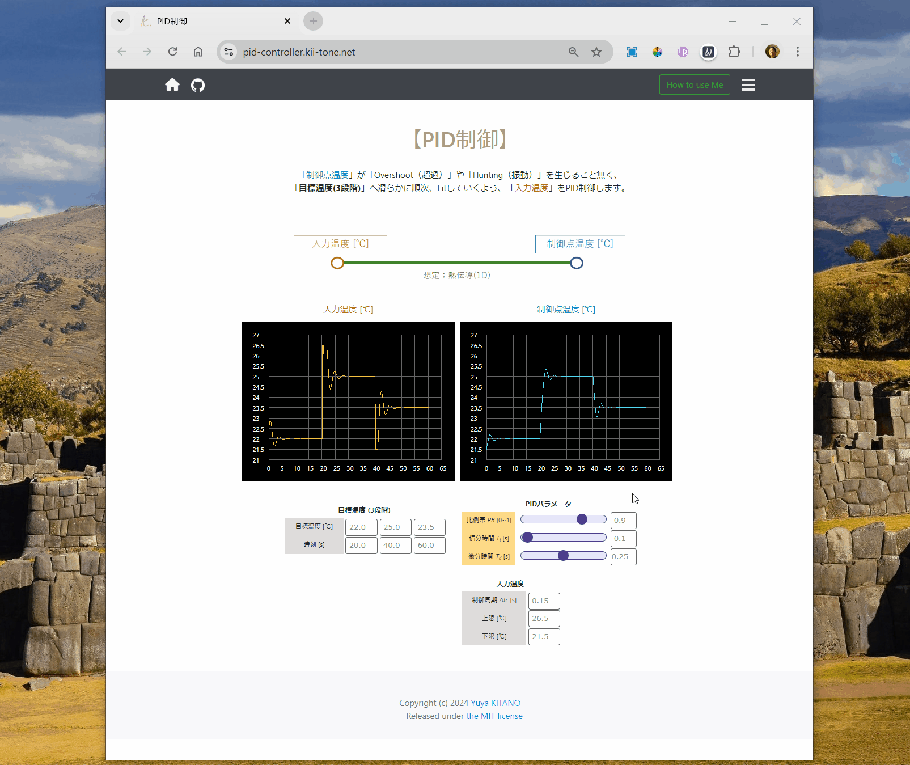

### Introduction

「制御点温度」が「目標温度(3段階)」へ滑らかに順次、Fitしていくよう、「入力温度」をPID制御します。

### Requirements

Google Chrome on a Desktop PC with 'Desktop site' mode preferred.

### Installation

Available now; No more additional installations needed.

### Usage

1. Webブラウザで [メインサイト](https://pid-controller.kii-tone.net/) へアクセスします.

2. 「制御点温度」の時間推移に、「Overshoot（超過）」や「Hunting（振動）」が現れなくなるよう、<b>[PIDパラメータ]</b> を調整します。

{ width=90% }
 
 